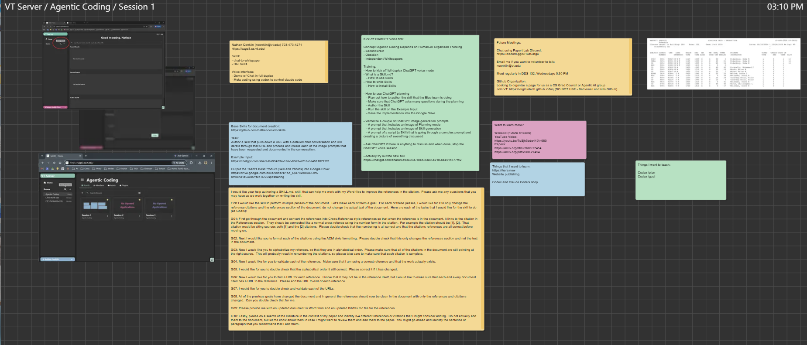

# Session 1: Skills and Reference Cleanup

Session 1 introduces reusable agent skills, with a worked example for cleaning up citations and references in a Microsoft Word document while preserving the paper's substantive text.

## Session board

Open the image for a larger view. The presentation materials are also available in [Sage](https://sage3.cs.vt.edu/), under **VT Server → Agentic Coding Board → Session 1**.

## Materials

- [Original skill-creation prompt](clean-up-references/PROMPT%20to%20Create%20Skill.txt) — the requested workflow and its ten goals.
- [Clean Up References skill instructions](clean-up-references/clean-up-references.md) — citation cross-references, ACM formatting, reference and URL validation, integrity checks, and BibTeX output.
- [Download the skill package](clean-up-references/clean-up-references.zip).

The skill also covers recommendations for additional literature, kept separate from the document's existing bibliography.

[Back to the meeting overview and schedule](../README.md)
