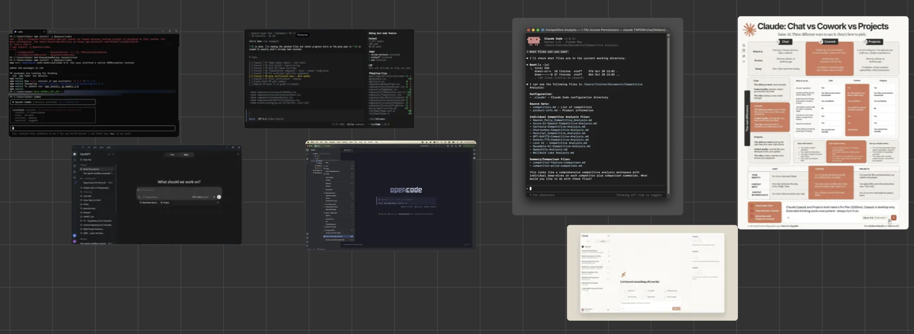

# Session 3: Agentic Coding Tools

Presentation materials from our discussion of agentic coding tools and interfaces, including Codex, OpenCode, and Claude. This session did not include a code project.

## Session board

Open the image for a larger view. The presentation materials are also available in [Sage](https://sage3.cs.vt.edu/), under **VT Server → Agentic Coding Board → Session 3**.

[Back to the meeting overview and schedule](../README.md)
