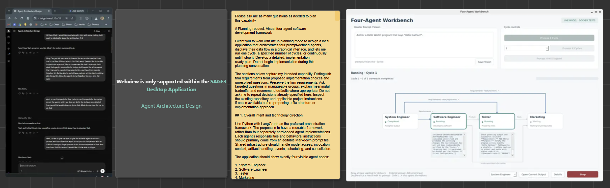
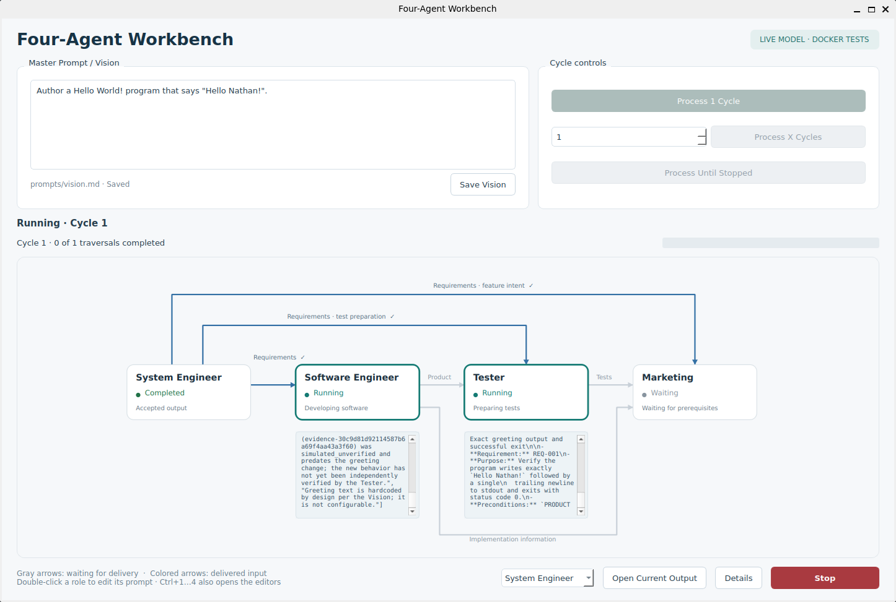

# Four-Agent Workbench

A local Python desktop application for a prompt-defined software team: System Engineer, Software Engineer, Tester, and Marketing. The interface shows four nodes and six data handoffs; LangGraph executes the internal dependencies.

Each cycle defines requirements, develops software and prepares tests concurrently, executes the tests, and produces an evidence-based feature brief. Later cycles refine the accepted product using prior test feedback. Stop cancels local work immediately and prevents late artifact acceptance.

## Session board



Open the image for a larger view. The presentation materials are also available in [Sage](https://sage3.cs.vt.edu/), under **VT Server → Agentic Coding Board → Session 4**.

## Workbench preview



## Install and launch

Use Python 3.12 or newer. The desktop uses PySide6 Essentials; Node.js and a local web server are not needed. See [Windows setup](docs/windows.md) or [Linux setup](docs/linux.md) for platform details.

```bash
python3 -m venv .venv
.venv/bin/python -m pip install -r requirements.lock
.venv/bin/python -m pip install --no-deps --no-build-isolation -e .
.venv/bin/python -m four_agent_workbench --mock
```

On Windows, replace `.venv/bin/python` with `.venv\Scripts\python.exe` and create the environment with `py -3.12 -m venv .venv`.

`--mock` uses a scripted Hello World fixture and clearly labelled simulated execution. It needs neither an API key nor Docker, and does not interpret arbitrary visions or claim real test passes.

For real Python/pytest execution, start Docker in Linux-container mode and build the runner:

```bash
docker build -t four-agent-runner:0.1 docker
.venv/bin/python -m four_agent_workbench --mock --real-tests
```

For live model calls, configure `.env` using [.env.example](.env.example), then launch without `--mock`:

```bash
.venv/bin/python -m four_agent_workbench --check
.venv/bin/python -m four_agent_workbench
```

Preserve your existing `.env`. The existing `OPENAI_API_BASE_URL`, `OPENAI_API_KEY`, and `OPENAI_API_MODEL` names are supported. The URL is a **complete chat-completions endpoint** and is used literally—even with the legacy `BASE_URL` name. A path such as `/api/v1` is not automatically expanded. `--check` validates configuration without making a model request.

## Use the workbench

1. Edit **Master Prompt / Vision** at the top left and click **Save Vision**. It is stored in `prompts/vision.md`.
2. Double-click a role, or press **Ctrl+1** through **Ctrl+4**, to edit its Markdown prompt. Save explicitly; Cancel preserves the saved file.
3. Select **Process 1 Cycle**, enter a positive count and select **Process X Cycles**, or select **Process Until Stopped**.
4. Follow active-node highlights, compact real activity previews, and delivered arrows. A colored arrow indicates delivered data; its destination can still be waiting.
5. Use **Details** for sanitized events and artifact references. Choose a role and **Open Current Output** to inspect its accepted files.
6. Press **Stop** to revoke scheduling and publication, close model streams, and force-remove active execution containers. New starts remain disabled until cleanup completes.

Saved vision and role-prompt edits take effect together at the next cycle. Unsaved drafts do not affect execution. Configuration/model changes apply on the next run; restart the application after changing prompt file paths or display names.

A new Start after cancellation begins a fresh cycle from System Engineer, retaining valid accepted outputs. It does not resume an interrupted invocation. Closing the window uses the same cancellation path.

**Completed cycles are successful workflow traversals, not a claim that product tests passed.** Ordinary failing tests are reported, supplied to Marketing, and used as feedback on the next cycle. Infrastructure failures stop the run.

## Files and artifacts

| Location | Contents |
|---|---|
| `framework/four_agent_workbench/` | Framework implementation |
| `framework_tests/` | Framework verification, separate from generated tests |
| `prompts/` | Vision and four editable role prompts |
| `config/workbench.toml` | Agent mappings, activity DAG, handoffs, models and limits |
| `src/requirements/` | Requirements revisions and `current.json` |
| `src/product/` | Generated Python product revisions and `current.json` |
| `src/tests/` | Generated test plans, tests, results and evidence revisions |
| `src/ads/` | Feature briefs and claims/evidence revisions |
| `.runtime/` | Local SQLite records, publication journal and prompt/config snapshots |

For example, a product is stored at `src/product/revisions/rev-…/main.py`. `current.json` points at a complete revision. Agents read pinned revisions, so test preparation and development cannot race through partly written files. Accepted revisions should not be edited manually; their hashes are checked. Use prompts to request changes or begin in a separate workspace.

Ten cycles of history are retained, plus current outputs and necessary evidence references. Generated revisions, staging, `.runtime`, `.env` and virtual environments are ignored by version control. Export any outputs you want to retain outside that local retention policy.

## Verification and demos

```bash
.venv/bin/python -m pytest -q
.venv/bin/python -m ruff check framework docker framework_tests
.venv/bin/python -m four_agent_workbench --mock --headless --cycles 4
.venv/bin/python -m four_agent_workbench --mock --scenario test_failure
.venv/bin/python -m four_agent_workbench --mock --scenario provider_error
.venv/bin/python -m four_agent_workbench --mock --scenario slow
```

Docker tests are opt-in. On Linux:

```bash
FAW_DOCKER_TESTS=1 QT_QPA_PLATFORM=offscreen .venv/bin/python -m pytest -q
```

On Windows PowerShell, set `$env:FAW_DOCKER_TESTS="1"` before running pytest. Framework tests use temporary workspaces and never contact your model provider.

An optional real-provider smoke test is an explicit live, one-cycle run with a small vision. It may incur your provider's normal charges. No live-provider call is made during installation or ordinary framework testing.

More detail: [architecture and contracts](docs/architecture.md), [configuration](docs/configuration.md), [troubleshooting](docs/troubleshooting.md).
